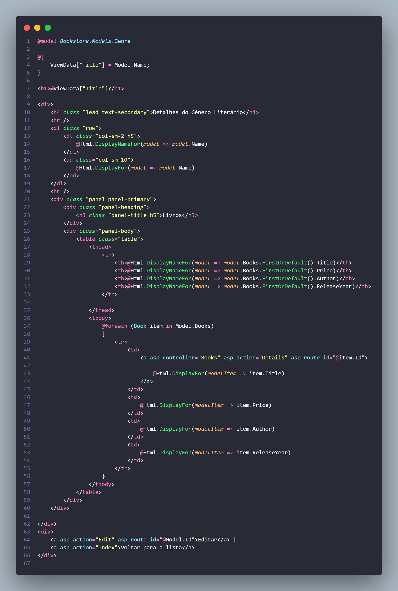

# Restante do Genre Details

Agora que conseguimos exibir também os dados dos livros de cada gênero, vamos criar a View para isso:

## View Details do Genre

Se vocês notarem como é o nosso código, irão ver que a maior parte dele é a exibição da tabela de livros e que na verdade ela tá basicamente igual, tirando a referência ao model que tivemos que mudar e também que agora não temos os três botões de Detalhes, Editar e Excluir, até poderia manter, mas queremos que o usuário só possa editar isso na aba de livros.

