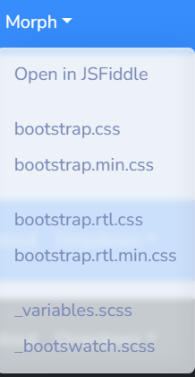

# Ajustes no Bootstrap

Agora que finalizamos a manipulação de uma das entidades, podemos dar uma pausa para mexer na estética do site, mais precisamemente no tema do Bootstrap.

Como vocês bem sabem, o Bootstrap permite estilização de páginas através da adição de classes pré-definidas às tags HTML diretamente, mas algo que talvez vocês não conheçam é a possibilidade de mudar completamente a estética do site sem precisar mudar uma classe.

Isso porque na prática o que fazemos é baixar um arquivo de CSS que foi feito pelo pessoal do Bootstrap no projeto e usar as classes que estão nele, mas o que impede a gente de baixar OUTRO arquivo de CSS com as mesmas classes mas outros estilos? Nada!

Entre nesse link:
[Bootswatch](https://bootswatch.com/)

Dêem uma olhada na aba Themes, lá existem várias opções de qual tema utilizar.

Depois de escolher uma opção, selecione para baixar o arquivo `bootstrap.min.css`:



Depois, abra a pasta `wwwroot`, dentro dela seleciona a pasta `lib` e depois `bootstrap`, por fim entre em `dist` e `css`, lá, substitua o arquivo com o mesmo nome ou adicione esse baixado com outro nome.

Se você só substituiu o anterior, já vai funcionar, se você adicionou o novo com outro nome, basta ir na view `_Layout` que diz qual é o HTML base de todas as páginas e trocar o caminho da tag link.

Exemplo:

Tag antes:

```html
<link rel="stylesheet" href="~/lib/bootstrap/dist/css/bootstrap.min.css" />
```

Tag depois, com o arquivo novo sendo chamado bootstrapMorph.min.css:

```html
<link rel="stylesheet" href="~/lib/bootstrap/dist/css/bootstrapMorph.min.css" />
```

Caso você julgue necessário, pode fazer as devidas alterações nas classes para se encaixar melhor nesse novo tema, basta ver que classes são usadas no site Bootswatch.

