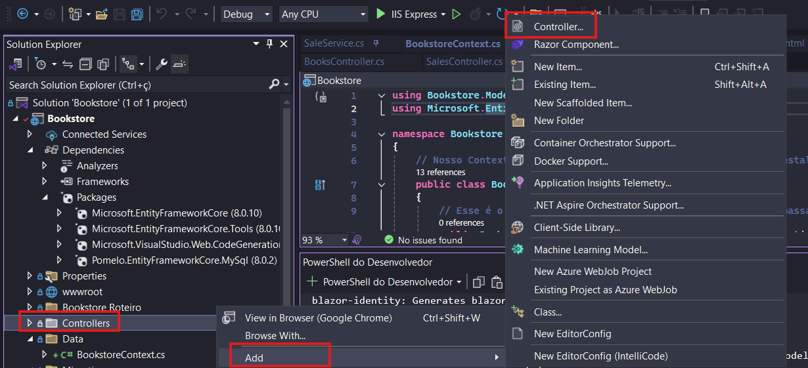
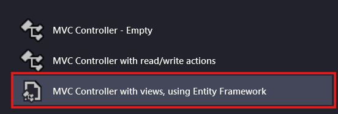
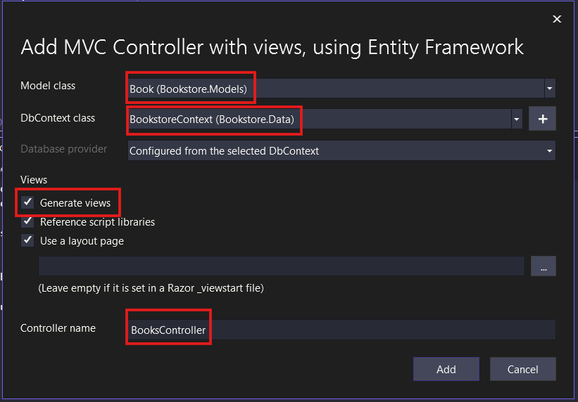

# Entidade Book e Crud Scaffolding

Agora que fizemos basicamente tudo sobre a entidade Genres, vamos criar a entidade Books, que armazenará os livros.

## Passo a passo

Vamos recapitular os passos para criar uma entidade no sistema:

1. Criar o Model dela - FEITO
2. Criar o Controller dela
3. Criar as Actions no Controller:
    1. Index (GET)
    2. Create (GET)
    3. Create (POST)
    4. Edit (GET)
    5. Edit (POST)
    6. Delete (GET)
    7. Delete (POST)
    8. Details (GET)
    9. Error (GET)
4. Criar o Service que acessa o banco
5. Inserir ele na lista de Services no Program.cs
6. Conectar a lógica do Controller com a do Service
7. Criar as Views desse Controller:
    1. Index
    2. Create
    3. Edit
    4. Delete
    5. Details

Bastante coisa né? Bom, lembra que eu falei que o Visual Studio é bom por fornecer algumas ferramentas auxiliares para acelerar o desenvolvimento? Então, uma delas é o chamado **CRUD Scaffolding**, que consiste em gerar um código base do controlador e das views. Sim, a gente consegue gerar o código de boa parte da entidade. A questão é que ele não é tão completo e organizado quanto o nosso próprio, então ainda assim vamos fazer bastante alterações, mas já ajuda.

## Fazendo CRUD Scaffolding do Book no VS Code

Para aqueles que estão desenvolvendo no VS Code, o processo também pode ser feito, mas pelo terminal através dos seguintes comandos:

Instalar a ferramenta de geração de código
```shell
dotnet tool install -g dotnet-aspnet-codegenerator
```

Instalar o pacote de Scaffolding
```shell
dotnet add package Microsoft.VisualStudio.Web.CodeGeneration.Design
```

Instalar o pacote do SQLServer (o terminal te obriga a ter ele, mas quando gera, usa o do MySQL)
```shell
dotnet add package Microsoft.EntityFrameworkCore.SqlServer
```

Comando de Scaffolding
```shell
dotnet aspnet-codegenerator controller -name BooksController -m Book -dc BookstoreContext -udl --relativeFolderPath Controllers
```

Comando de remover o pacote do SqlServer (só instalamos para ele não apontar erro)
```shell
dotnet remove package Microsoft.EntityFrameworkCore.SqlServer
```

Na parte do `controller -name BooksController` estamos dizendo o nome do Controller que será criado.

Na parte do `-m Book` dizemos qual é a Model que deve ser vinculada a esse controller (ela já deve existir).

Na parte do `-dc BookstoreContext` devemos dizer qual é o Context usado.

Na parte do `-udl` especificamos que queremos que gere as views também.

Na parte do `--relativeFolderPath Controllers` dizemos que é para adicionar o SellersController na pasta Controllers, não na raiz do projeto.

## Fazendo CRUD Scaffolding do Book no Visual Studio 2022

No Visual Studio podemos fazer esse processo apenas

Botão direito na Pasta Controllers > Add > Controller:



Selecione Controller MVC com views usando Entity Framework:



Selecione qual é a Model vinculada, qual é o Context, selecione a opção de gerar views e também verifique se o nome está correto, nesse caso, `BooksController`:



## Analizando o código

Como podemos ver, o código ficou aparentemente bem completo, com algumas ressalvas importantes:

1. A parte que aparece para o usuário está em inglês
2. O Controller está diretamente acessando o banco de dados, o que desrespeita a divisão de responsabilidades das classes, ele deve ser apenas o mensageiro e alguém do nível de modelo da aplicação (o service) deve realmente acessar o banco de dados.
3. As views não exibem tudo que queremos, por exemplo, não exibem os gêneros dos livros.
