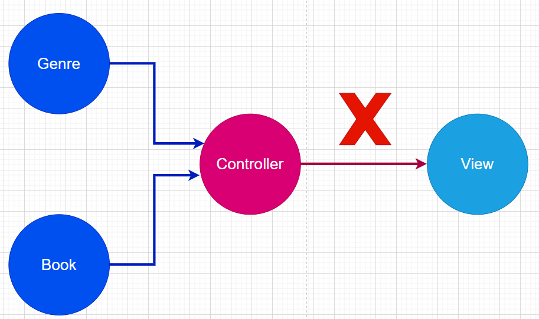
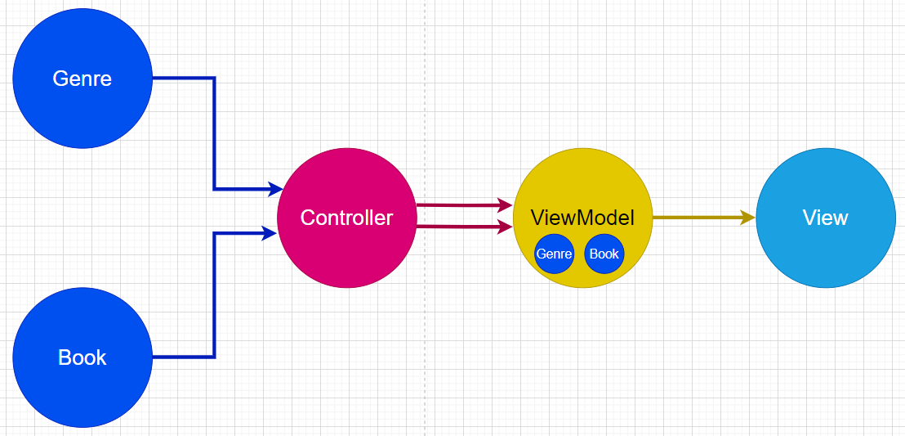
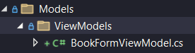

# Consertando Genre do Book

## Consertando View

Em termos de ajustes estéticos, cada um pode escolher quais fazer de acordo com o tema escolhido e com suas preferências, exemplo:

- Deixar a tabela mais dinâmica (com hover);
- Mudar a cor dos textos para contrastar melhor.
- Alterar a margin e o padding dos botões.

Ajustes com relação a exibir o gênero serão feitos depois, pois faremos mudanças no controlador que, por sua vez, farão nas views, então teríamos que mexer com isso duas vezes se mexessemos agora.

## Consertando Controllers para permitir mostrar Genres

Vamos focar em uma Action de cada vez, teremos que fazer alterações no código do Controller e/ou do Service das seguintes actions:

1. Index (service)
2. Create GET (controller)
3. Create POST (controller)
4. Edit GET (controller e service)
5. Edit POST (controller e service)
6. Delete GET (service)
7. Delete POST (não precisa) ✔️
8. Details (service)
9. Error (não precisa) ✔️

Essas mudanças tem relação em alguns casos com EagerLoading e em outros com a criação de uma nova ViewModel, vamos entender cada um deles.

## Mudança no Index

Como dito, a Action em sí não precisa mudar, mas o controller sim, isso porque caso a gente mande exibir os gêneros literários dos livros, eles não serão exibidos. Como vocês bem devem lembrar, se a gente tem uma entidade principal mas quer exibir informações de outra que está vinculada a ela, precisamos implementar o Eager Loading, que é o carregamento ansioso da entidade principal e das vinculadas.

Para fazer isso, precisamos apenas de uma pequena alteração no método **FindAllAsync**:

```c#
// GET Books/Index
public async Task<List<Book>> FindAllAsync()
{
    return await _context.Books.Include(x => x.Genres).ToListAsync();
}
```

A alteração é a adição do `Include(x => x.Genres)`, agora toda vez que buscarmos todos os livros, buscaremos também seus gêneros vinculados.

## Mudança no Delete GET

Vamos pular por enquanto as alterações das Actions de Edit, pois a razão para o erro delas é outra. Na Action Delete do tipo GET, ou seja, na que carrega os dados do livro e pergunta se de fato queremos apagar ele, precisamos carregar os dados dos gêneros vinculados a ele também.

Para fazer isso, repetiremos o mesmo processo do método FindAllAsync, mas agora no **FindByIdAsync**:

```c#
public async Task<Book> FindByIdAsync(int id)
{
    return await _context.Books.Include(x => x.Genres).FirstOrDefaultAsync(x => x.Id == id);
}
```

Notem que novamente adicionamos o `Include`, basicamente para carregar a lista de gêneros vinculados ao livro que queremos carregar os dados.

## Mudança no Details

A mudança que precisavamos fazer nessa Action era na verdade a mesma do anterior, o método FindByIdAsync não carregava os dados dos gêneros do livro antes, agora carrega.

Inclusive na Action Edit do tipo GET, a mudança no service que precisávamos era relacionada a isso também.

## Status atual

Até agora, consertamos esses problemas:

1. Index (service) ✔️
2. Create GET (controller)
3. Create POST (controller)
4. Edit GET (controller)
5. Edit POST (controller e service)
6. Delete GET (service) ✔️
7. Delete POST (não precisa) ✔️
8. Details (service) ✔️
9. Error (não precisa) ✔️

Os quatro problemas que faltam consertar tem relação com a gente precisar bolar uma forma de permitir que o usuário selecione dentro da lista de todos os gêneros, quais o livro irá possuir. Mas antes disso, vamos consertar as views de Index, Delete e Details, já que o controller e o service estão prontos para exibir elas.

## Views Index, Delete e Details

### Index
Na view Index, só precisamos adicionar uma nova coluna na tabela que percorre a lista de gêneros que cada livro tem:

```html
@foreach (var item in Model) {
    <tr>
        <td class="text-primary-emphasis">
            @Html.DisplayFor(modelItem => item.Title)
        </td>
            <td class="text-primary-emphasis">
            @Html.DisplayFor(modelItem => item.Price)
        </td>
            <td class="text-primary-emphasis">
            @Html.DisplayFor(modelItem => item.Author)
        </td>
            <td class="text-primary-emphasis">
            @Html.DisplayFor(modelItem => item.ReleaseYear)
        </td>
        <td>
            @foreach(Genre genre in item.Genres)
            {
                <a asp-controller="Genres" asp-action="Details" asp-route-id="@genre.Id" class="text-primary">@genre.Name</a> <br />
            }                    
        </td>
        <td class="text-right">
            <a type="button"
                title="Detalhes"
                class="btn btn-outline-info px-2 py-1 rounded mx-1"
                asp-action="Details"
                asp-route-id="@item.Id">
                <i class="bi bi-list-ul"></i>
            </a>
            <a type="button"
                title="Editar"
                class="btn btn-outline-warning px-2 py-1 rounded mx-1" asp-action="Edit"
                asp-route-id="@item.Id">
                <i class="bi bi-pencil-fill"></i>
            </a>
            <a type="button"
                title="Excluir"
                class="btn btn-outline-danger px-2 py-1 rounded mx-1"
                asp-action="Delete"
                asp-route-id="@item.Id">
                <i class="bi bi-trash-fill"></i>
            </a>
        </td>
    </tr>
}
```
Lembrando que alterações mais específicas de estética ficam a cargo de vocês.

### Delete

Aqui só precisamos fazer um processo similar:

```html
<dt class="col-sm-2 text-primary-emphasis">
    @Html.DisplayNameFor(model => model.Genres)
</dt>
<dd class="col-sm-10">
    @foreach (Genre genre in Model.Genres)
    {
        <a asp-controller="Genres" asp-action="Details" asp-route-id="@genre.Id" class="text-primary">
            @Html.DisplayFor(genreItem => genre.Name)
        </a>
        <br />
    }
</dd>
```

### Details

Aqui o código é o mesmo do Delete.

Agora finalizamos as três telas, precisamos fazer apenas a de criar livros e a de editar livros, mas essas duas serão as mais difíceis.

## ViewModel para exibir Gêneros

O que nós queremos fazer é um lista de seleção que permita múltiplas opções, algo como isso:


Mas no caso, mostrando todos os gêneros disponíveis, essa lista deve aparecer tanto na hora de criar o livro quanto na hora de editar ele.

Para fazer isso, precisaremos criar uma ViewModel. Recaptulando, uma viewmodel é um model que serve apenas de auxiliar para exibir dados na View, ele não será uma tabela no banco nem nada do tipo. Fazemos isso pois teoricamente só podemos passar uma model para a view, dessa forma passamos essa view model contendo duas ou mais models normais.

Normalmente tentariamos isso, mas não dá.


Então criamos uma ViewModel feita dos dois models:


#### Mas como fazemos isso?

Primeiro precisamos criar o seguinte arquivo:



Essa viewModel, como disse, é basicamente uma união de outras models numa só, o livro que está para ser criado (ou o que foi selecionado para editar) e todos os gêneros disponíveis.

Por dentro, ela será assim:

```c#
public class BookFormViewModel
{
    // No Create, esse é o livro que será criado
    // No Edit, é o livro que está sendo editado
    public Book Book { get; set; }

    // Essa é a lista de gêneros disponíveis, buscados no banco de dados
    public ICollection<Genre> Genres { get; set; } = new List<Genre>();

    // Essa é a lista de gêneros que foram selecionados
    // Usaremos essa propriedade para verificar se foi selecionado algum gênero
    // E também para armazenar quais gêneros o usuário selecionou
    [Display(Name = "Gêneros Literários")]
    [Required(ErrorMessage = "O campo {0} é obrigatório")]
    public List<int> SelectedGenresIds { get; set; } = new List<int>();

    // Embora tenha uma estrutura diferente, isso é uma propriedade também, mas apenas de leitura
    // Isso porque nós já definimos o valor dela de cara
    // O valor dela é o que o método ao lado da arrow function retornar
    public List<SelectListItem> GenresSelect => GenerateGenresSelect();

    // Para exibir um item naquelas listas de seleção, ele precisa ser um objeto do tipo SelectListItem
    // Aqui pegamos a lista de gêneros, percorremos ela e criamos um objeto desse tipo para cada um
    // Cada um deles tem dois atributos, o Value e o Text
    // O Text é o que aparece na tela, queremos que apareça o nome do gênero correspondente
    // O Value é o que é salvo numa lista quando o usuário seleciona uma opção
    // Queremos que sejam salvos os ids dos gêneros que forem selecionados
    private List<SelectListItem> GenerateGenresSelect()
    {
        List<SelectListItem> genresSelect = new List<SelectListItem>();
        if (Genres is not null)
        {
            foreach (Genre genre in Genres)
            {
                genresSelect.Add(new SelectListItem { Value = genre.Id.ToString(), Text = genre.Name });
            }
        }
        return genresSelect;
    }
}
```

Bastante coisa né?

Agora precisamos alterar as Actions do controlador e também um dos métodos do Service. Isso porque eles precisam enviar e receber essas ViewModels, não apenas objetos Book.

1. Create GET (controller)
2. Create POST (controller)
3. Edit GET (controller)
4. Edit POST (controller e service)

## Segunda refatoração do Create GET

```c#
// Antes

// GET: Books/Create
public async Task<IActionResult> Create()
{
    return View();
}

// Depois
public async Task<IActionResult> Create()
{
    List<Genre> genres = await _genreService.FindAllAsync();

    BookFormViewModel viewModel = new BookFormViewModel { Genres = genres };
    return View(viewModel);
}
```

Dessa vez precisamos tornar o método assíncrono pois ele busca um dado no banco de dados.

Se você for atento, irá notar que o atributo usado para buscar o dado não é o `_service` mas sim um tal de `_genreService`, isso mesmo, como agora precisaremos montar uma viewModel composta de livros E gêneros, para buscar os gêneros, precisaremos do GenreService no nosso Controller, portanto, precisamos adaptar a classe:

```c#
public class BooksController : Controller
{
    private readonly BookService _service;
    private readonly GenreService _genreService;

    public BooksController(BookService service, GenreService genreService)
    {
        _service = service;
        _genreService = genreService;
    }
...
```

Agora para fazer sentido a alteração que fizemos no nosso controller, antes de irmos para o próximo, já vamos consertar a View também.

## View Create

Nela, de cara já notamos que o Model é na verdade a ViewModel:

```c#
@model Bookstore.Models.ViewModels.BookFormViewModel
```

É possível notar isso através do parâmetro sendo passado dentro do `View()` na Action que refatoramos.

Agora todos os locais em que especificamos que queremos exibir dados do livro, que antes eram tipo assim:

```html
<label asp-for="Title" class="control-label"></label>
<input asp-for="Title" class="form-control" />
<span asp-validation-for="Title" class="text-danger"></span>
```

Agora serão assim:

```html
<label asp-for="Book.Title" class="control-label"></label>
<input asp-for="Book.Title" class="form-control" />
<span asp-validation-for="Book.Title" class="text-danger"></span>
```

Note a referência Book.Title, é que a model tem alguns atributos, dentre eles, o Book, que é o livro em si.

Agora vamos para a parte interessante, a lista de seleção múltipla:

```html
<div class="form-group">
    <label asp-for="SelectedGenresIds" class="control-label"></label>
    <br />
    <span class="text-muted">Segure Ctrl para selecionar mais de um item</span>
    <select multiple="multiple" asp-for="SelectedGenresIds" asp-items="Model.GenresSelect" placeholder="Selecione o Gênero Literário" class="form-select"></select>
    <span asp-validation-for="SelectedGenresIds" class="text-danger"></span>
</div>
```

Essa lista permite seleção múltipla por ter um atributo `multiple`.

O atributo `asp-for` contém o SelectedGenresIds, que como vimos, é a lista da ViewModel que salva os ids selecionados.

O `asp-items` define o que vai aparecer para o usuário escolher, no caso, a lista de SelectListItem que a gente criou na viewModel.

O `span` de validação, bem como a `label` são vinculados também à lista de Id's, pois é ela que contém as anotações de validação, como a que torna ela obrigatória.

## Segunda refatoração do Create POST

Agora que editamos a Action que carrega a View de criar livro e a view de criar livro em sí, precisamos editar a Action que de fato salva o novo livro criado.

Nesse caso precisamos fazer uma conexão entre os Id's que o usuário selecionou naquela lista múltipla e a lista de gêneros do livro a ser criado:

```c#
[HttpPost]
[ValidateAntiForgeryToken]
public async Task<IActionResult> Create(BookFormViewModel viewModel)
{
    // Se nem todos os dados da viewModel estão preenchidos corretamente
    if (!ModelState.IsValid)
    {
        // Carrega os gêneros para eles aparecerem na lista de exibição
        viewModel.Genres = await _genreService.FindAllAsync();
        // E recarrega a página de Create
        return View(viewModel);
    }

    // caso esteja tudo certo, cria uma lista no atributo Genres do livro criado
    viewModel.Book.Genres = new List<Genre>();

    // Percorre todos os ids que foram selecionados pelo usuário na lista
    foreach (int genreId in viewModel.SelectedGenresIds)
    {
        // Busca um de cada vez no banco de dados
        Genre genre = await _genreService.FindByIdAsync(genreId);
        // Se de fato existe um gênero com esse Id
        if (genre is not null)
        {
            // Adiciona esse gênero na lista do livro
            viewModel.Book.Genres.Add(genre);
        }
    }
    // Em essência, pega todos os ids selecionados, busca os gêneros no banco
    // e vincula eles ao livro que vai ser criado
    
    // Insere o novo livro com esses dados vinculados.
    await _service.InsertAsync(viewModel.Book);

    // Redireciona para a tela que exibe todos os livros.
    return RedirectToAction(nameof(Index));
}
```

Pronto, nosso sistema de adicionar livros está pronto.
Agora vamos para o sistema de editar livros, a action que carrega a página de edição, bem como a página em sí mudam muito pouco, mas a action que atualiza os dados no banco de dados precisará de uma lógica de código bem grande, isso porque o método tradicional de Update não funciona normalmente para a situação que queremos.

## Segunda refatoração do Edit GET

Aqui, como disse, não muda muita coisa em relação ao Create GET:

```c#
// Antes

// GET: Books/Edit/x
public async Task<IActionResult> Edit(int? id)
{
    if (id is null)
    {
        return RedirectToAction(nameof(Error), new { message = "Id não fornecido" });
    }

    var obj = await _service.FindByIdAsync(id.Value);
    if (obj is null)
    {
        return RedirectToAction(nameof(Error), new { message = "Id não encontrado" });
    }

    return View(obj);
}

// Depois

// GET: Books/Edit/x
public async Task<IActionResult> Edit(int? id)
{
    if (id is null)
    {
        return RedirectToAction(nameof(Error), new { message = "Id não fornecido" });
    }

    var obj = await _service.FindByIdAsync(id.Value);
    if (obj is null)
    {
        return RedirectToAction(nameof(Error), new { message = "Id não encontrado" });
    }

    List<Genre> genres = await _genreService.FindAllAsync();
    BookFormViewModel viewModel = new BookFormViewModel { Book = obj, Genres = genres };

    return View(viewModel);
}
```

Basicamente o que fizemos foi, ao invés de passar o livro pra view exibir os dados dele, passamos o livro e também todos os gêneros, essa é, afinal de contas, a razão pela qual criamos a viewModel.

## View Edit

Aqui precisaremos adicionar a lista exatamente como na view de Create, assim como arrumar as outras referências:

```html
<div class="form-group">
    <label asp-for="SelectedGenresIds" class="control-label"></label>
    <br />
    <span class="text-muted">Segure Ctrl para selecionar mais de um item</span>
    <select multiple="multiple" asp-for="SelectedGenresIds" asp-items="Model.GenresSelect" placeholder="Selecione o Gênero Literário" class="form-select"></select>
    <span asp-validation-for="SelectedGenresIds" class="text-danger"></span>
</div>
```

## Segunda refatoração do Edit POST

Vamos dar uma olhada no código da action antes:

```c#
// Antes
[HttpPost]
[ValidateAntiForgeryToken]
public async Task<IActionResult> Edit(int id, Book book)
{
    if (!ModelState.IsValid)
    {
        return View();
    }
    if (id != book.Id)
    {
        return RedirectToAction(nameof(Error), new { message = "Id's não condizentes" });
    }

    try
    {
        await _service.UpdateAsync(book);
        return RedirectToAction(nameof(Index));
    }
    catch (ApplicationException ex)
    {
        return RedirectToAction(nameof(Error), new { message = ex.Message });
    }
}
```
A gente verificava se o id existe e depois se o objeto corresponde àquele id existe, se os dois existem, a gente tenta atualizar com o método `UpdateAsync` do nosso Service, lá ele usava o método `Update` do Context para atualizar automaticamente no banco de dados.

Agora vamos ver a versão final

```c#
[HttpPost]
[ValidateAntiForgeryToken]
public async Task<IActionResult> Edit(int id, BookFormViewModel viewModel)
{
    if (!ModelState.IsValid)
    {
        return View();
    }
    if (id != viewModel.Book.Id)
    {
        return RedirectToAction(nameof(Error), new { message = "Id's não condizentes" });
    }

    try
    {
        await _service.UpdateAsync(viewModel);
        return RedirectToAction(nameof(Index));
    }
    catch (ApplicationException ex)
    {
        return RedirectToAction(nameof(Error), new { message = ex.Message });
    }
}
```

A gente basicamente faz a mesma coisa, mas passamos a viewModel inteira para o service, não só o livro.

Agora precisamos modificar o método `UpdateAsync` do Service para que ele consiga atualizar o nosso livro.

## Método UpdateAsync do Service

Tenho uma boa e uma má notícia.

A boa é que esse é o último item que precisamos modificar da entidade Books, a má é que é de longe o maior.

Isso porque antes a gente conseguia atualizar o livro com um simples `_context.Update(book)` em que passávamos o novo livro e ele se virava para trocar o antigo por esse.

Agora, por termos a lista de gêneros sendo editada também, fazer apenas isso causa uma exceção, a solução para isso, infelizmente, é atualizar manualmente os gêneros do livro.

Precisamos verificar quais gêneros continuam sendo parte da lista de um livro e quais deixaram de ser, assim como precisamos verificar quais novos gêneros entraram, tudo isso para retirar ou adicionar manualmente eles, só depois atualizando os outros dados.

Por isso o método ficou grande, vamos ver:

```c#
public async Task UpdateAsync(BookFormViewModel viewmodel)
{
    bool hasAny = await _context.Books.AnyAsync(x => x.Id == viewmodel.Book.Id);
    if (!hasAny)
    {
        throw new NotFoundException("Id não encontrado");
    }

    try
    {
        // Livro do banco de dados
        Book? dbBook = await _context.Books.Include(x => x.Genres).FirstOrDefaultAsync(x => x.Id == viewmodel.Book.Id);

        // Lista de gêneros selecionados na View
        List<Genre> selectedGenres = new List<Genre>();

        // Para cada id na lista de ids selecionados na view
        foreach (int genreId in viewmodel.SelectedGenresIds)
        {
            // Busca qual é o gênero desse Id
            Genre genre = await _context.Genres.FirstOrDefaultAsync(x => x.Id == genreId);
            // Se de fato tiver um gênero
            if (genre is not null)
            {
                // Põe ele na lista de gêneros selecionados
                selectedGenres.Add(genre);
            }
        }
        // Lista de gêneros que o livro tem atualmente no banco
        List<Genre> currentGenres = dbBook.Genres.ToList();

        // Busca todos os gêneros atuais que NÃO estão nos selecinados (gêneros que estavam e não estão mais)
        List<Genre> genresToRemove = currentGenres.Where(current => !selectedGenres.Any(selected => selected.Id == current.Id)).ToList();

        // Lógica contrária
        // Busca todos os gêneros selecionados que NÃO estão nos atuais (gêneros que não estavam e agora estarão)
        List<Genre> genresToAdd = selectedGenres.Where(selected => !currentGenres.Any(current => current.Id == selected.Id)).ToList();

        foreach (Genre genre in genresToRemove)
        {
            dbBook.Genres.Remove(genre);
        }

        foreach (Genre genre in genresToAdd)
        {
            dbBook.Genres.Add(genre);
        }

        await _context.SaveChangesAsync();
    }
    catch (DbUpdateConcurrencyException ex)
    {
        throw new DbConcorrencyException(ex.Message);
    }
}
```

Loucura né, falei para vocês que Back-end é difícil, mas não é impossível, e eu pessoalmente acho mais divertido que front-end.

Bom, agora finalizamos toda a entidade Book, isso quer dizer que o próximo passo é irmos para o vendedor ou a venda, faremos primeiro o vendedor.
